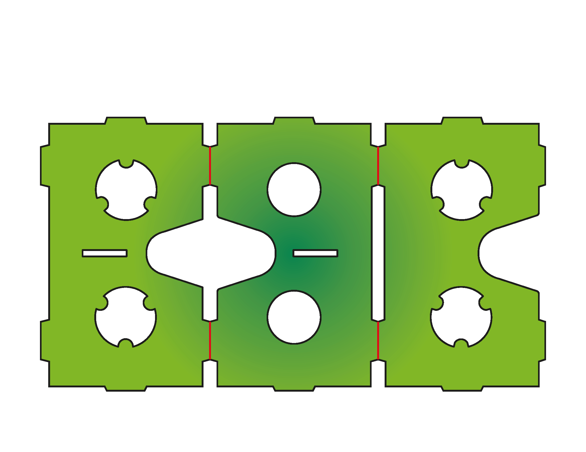
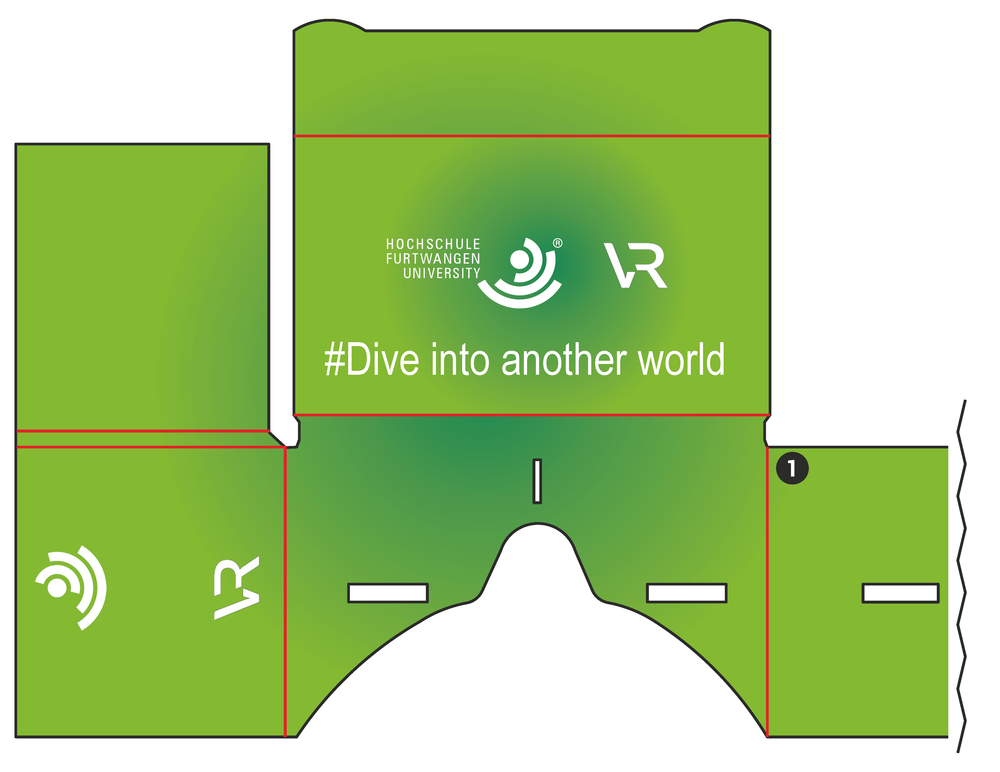
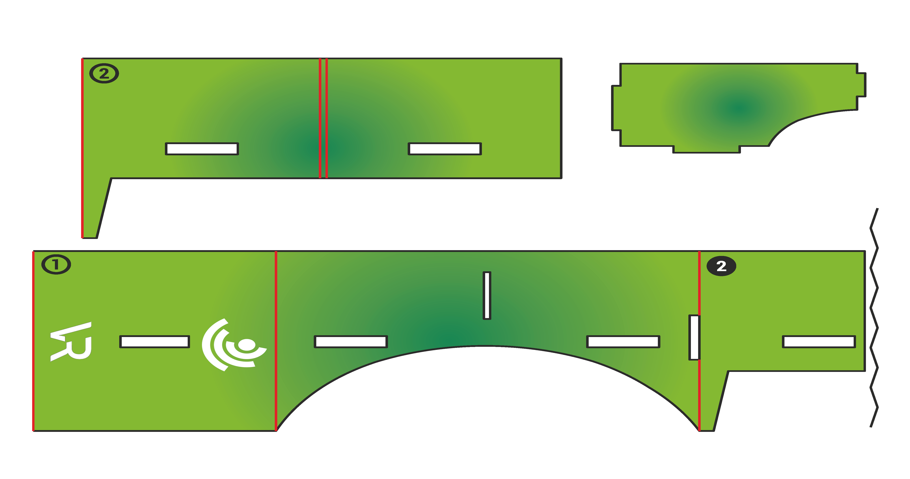

# VR Cardboardbrille

##Inhalt
*Design
*Basteln
*Probleme

##Design
Beim Design habe ich mich für einen Farbverlauf der primär und Sekundärfarbe der HFU entschieden. Vorne ist die Brille mit dem gesamten Logo der HFU plus VR Logo versehen. Dazu noch der Claim "#Dive into another world". Auf den Seiten befindet sich jeweils die Bildmarke der HFU und ebenfalls ein VR Logo. 

##Basteln
Für das Basteln habe ich mir alle mir zur Verfügung stehenden Werkzeuge vorab bereitgelegt.

###Timelapse
Zudem habe ich mir ein alternatives Stativ zusammen gebaut um das Basteln zu filmen.
<video width="600px" controls>
  <source src="img/Cardboardbasteln_komprimiert.mp4" type="video/mp4">
</video>
###Endergebnis

##Probleme
Folgende Probleme sind im Laufe dieser Aufgabe bei mir aufgetreten:

1. Da ich bei mir kein Teppichmesser oder ähnliches in der Wohnung habe, war es schwer die die Aussparungen innerhalb der Bastelvorlage auszuschneiden. 
2. Da der Kleber alleine nicht gereicht hat, musste ich des öfteren mit Klebestreifen nachhelfen
3. Als Brillenträger kann ich die Brille in dieser Form nicht nutzen, da ich mit meiner Sehhilfe nicht durch die VR BRille schauen kann.
4. Mein Smartphone ist zu groß für diese Vorlage, weshalb ich die Lasche die normalerweise das Handy auf einer Seite stabilisieren soll nach außen klappen muss, so das mein Handy auf beiden Seiten rausschaut.